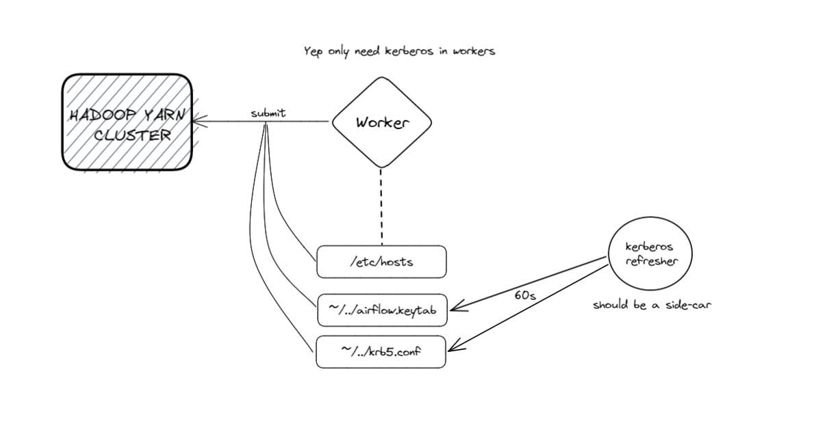

# airflow-x-kbr-hdfs

Apache Airflow integration with HDFS, spark and kerberos enabling. Even tho the manifest is crap, it still give you the idea of how this works.

       

 

## Something to add
The airflow images is way too big, move all **.jars** to hdfs cluster and change default config.